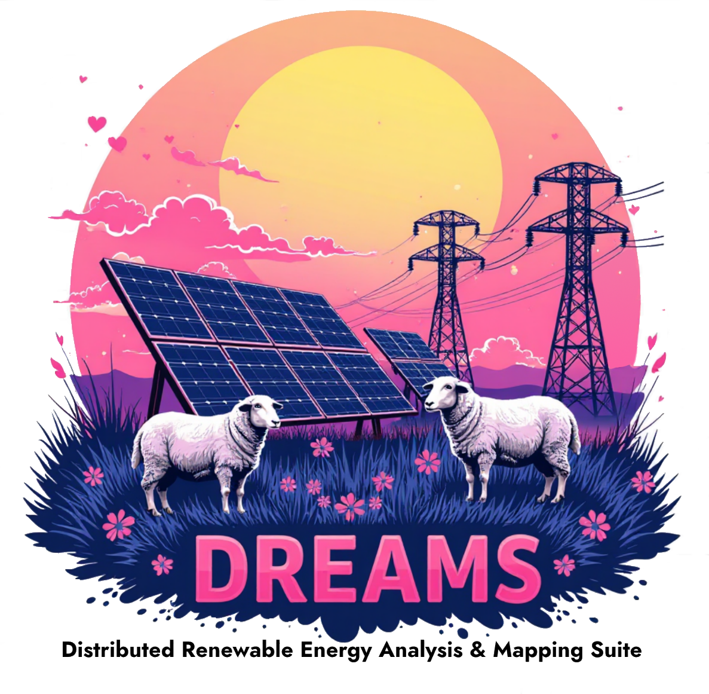

# DREAMS

DREAMS stands for Distributed Renewable Energy Analysis and Mapping Suite. 

DREAMS is a Python package intended to facilitate the creation, simulation, 
and analysis of snapshot and quasi-static time series hosting capacity 
simulations involving distribution systems modeled in OpenDSS. 

DREAMS is also designed to export geospatial data files which allow easier 
visualization, troubleshooting, and mapping of system models. 


## Installation Process
The install described utilizes an anaconda virtual environment, and may
not be applicable to all situations, but has been historically valid.

* Process seems to go smoother help if 'installation' console/terminal 
window is opened in administrator mode.

* VPNs have also been known to cause installation issues.

1. Create new anaconda environment:
```
conda create -n <ENV NAME> python=3.10.6
conda activate <ENV NAME> 
```

2. Execute `pip install -e .` from main repo directory to install 
package and allow modifications to be applied to the code without 
re-installation.

4. Execute `conda install ipykernel` so that Jupyter Notebook demos 
can run.

## Usage
* See ipynb files in demos folder.

## Studies Employing DREAMS
* [QSTS Simulation of Centralized PV and Controlled Storage on a Distribution System using Python](https://doi.org/10.1109/PESGM52009.2025.11225534)
* [Optimizing Distributed Energy Storage Sizing in Puerto Rico: Leveraging Increased Distributed Generation for Enhanced Resilience](https://doi.org/10.2172/2585558)
* [Puerto Rico Grid Resilience and Transitions to 100% Renewable Energy Study (PR100): Final Report - Chapter 11, Distribution System Impacts](https://doi.org/10.2172/2335361)

## Support
Created by Thad Haines - jthaine@sandia.gov.

## Roadmap
* TBD

## Contributing
* Open and ongoing.

## Acknowledgments
* `sfo_p1udt1469` model included in this repository adapated from data [available here](https://data.openei.org/submissions/2981).

## License
* MIT

## Project status
* TBD